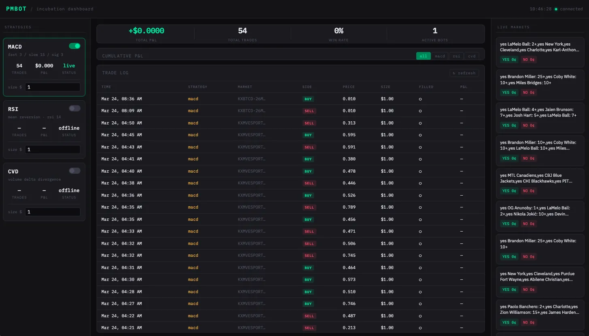

# Kalshi Algorithmic Trading Bot

A full-stack algorithmic trading system that places real limit orders on [Kalshi](https://kalshi.com) — a CFTC-regulated US prediction market exchange. Built in Python and vanilla JavaScript.



## What it does

- Fetches live candlestick price data from Kalshi's API every 60 seconds
- Runs a MACD crossover strategy to generate BUY/SELL signals
- Places real limit orders automatically via the Kalshi API
- Tracks all trades and P&L in a local SQLite database
- Displays everything on a live dashboard with a P&L chart, trade log, and bot controls

## Why I built it

I wanted to expand beyond my JavaScript background and learn Python, async programming, and data pipelines — so I picked a project that would force me to use all three at once. The bot has placed real trades on Kalshi and is running live.

## Tech stack

| Layer | Technology |
|-------|-----------|
| Backend | Python, FastAPI, SQLAlchemy, aiosqlite |
| Trading | Kalshi Python async SDK, pandas |
| Frontend | Vanilla JS, Chart.js, HTML/CSS |
| Database | SQLite |

## Project structure

```
kalshi-trading-bot/
├── backend/
│   ├── main.py                      # FastAPI app entry point
│   ├── app/
│   │   ├── bots/
│   │   │   ├── indicators.py        # MACD, RSI, VWAP (pure pandas)
│   │   │   └── macd_strategy.py     # MACD crossover strategy
│   │   ├── models/
│   │   │   ├── database.py          # SQLAlchemy table definitions
│   │   │   └── db.py                # DB connection + session management
│   │   ├── routes/
│   │   │   ├── trades.py            # Trade history endpoints
│   │   │   ├── bots.py              # Bot control endpoints
│   │   │   └── market.py            # Kalshi market data endpoints
│   │   └── services/
│   │       ├── scheduler.py         # Bot execution loop (asyncio)
│   │       └── trader.py            # Kalshi order placement
│   └── tests/
│       └── test_macd_strategy.py
└── dashboard/
    ├── index.html
    └── src/
        ├── components/              # Chart, trade table, bot cards
        └── services/api.js          # All backend API calls
```

## How the bot works

```
Every 60 seconds:
  1. Fetch candlestick data from Kalshi API
  2. Run MACD crossover strategy on price history
  3. If BUY/SELL signal: place limit order via Kalshi API
  4. Log trade to SQLite database
  5. Dashboard updates automatically
```

## Running locally

**Backend**
```bash
cd backend
python -m venv venv
source venv/bin/activate
pip install -r requirements.txt
pip install greenlet kalshi_python_async
cp .env.example .env
# Add your Kalshi API key and private key path to .env
uvicorn main:app --reload
```

**Dashboard**
```bash
cd dashboard
python -m http.server 5500
# Open http://localhost:5500
```

**API docs** available at `http://localhost:8000/docs`

## Environment variables

```
KALSHI_API_KEY_ID=your-api-key-id
KALSHI_PRIVATE_KEY_PATH=./kalshi_private_key.pem
KALSHI_HOST=https://api.elections.kalshi.com/trade-api/v2
DRY_RUN=true
DATABASE_URL=sqlite+aiosqlite:///./data/bot.db
DEFAULT_POSITION_SIZE=1.0
```

Set `DRY_RUN=false` to place real orders.

## API endpoints

| Method | Path | Description |
|--------|------|-------------|
| GET | /api/trades | Trade history |
| GET | /api/trades/summary | P&L summary |
| GET | /api/bots | Bot status |
| POST | /api/bots/start | Start a bot |
| POST | /api/bots/stop/{strategy} | Stop a bot |
| GET | /api/market/events | Live Kalshi markets |

## Author

William McDermott — [github.com/william-mcdermott](https://github.com/william-mcdermott)
